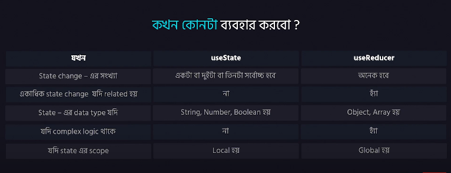

# UseReducer
- React a state change korar ekta mechanism
- declaration -> useReducer(reducer, initialState). Here reducer is a function that takes the current state and a action. Action is defined by the user(it depends on use case)
- newState = reducer(currentState, action).Reducer function always returns the new state of the current state
- useReducer returns a tuple -> [newState/updatedState, dispatch]. Here dispatch is mainly action
- 